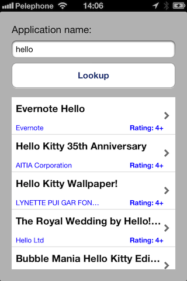

#OnAppStore
 
This a demo application showing how programmatically find an application on the <i>App Store</i>, retrieve the available technical information about this app and call <i>StoreKit</i> View Controller to show the app on the <i>App Store</i>.
 

 
<i>Apple Search API</i> allows me to retrieve information about the application. For example, the following line will bring info about all applications that has "hello" in their name:
<pre><code>https://itunes.apple.com/search?term=hello&country=il&entity=software
</code></pre>
The response is a simple JSON like:
<pre><code>{
 "resultCount":50,
 "results": [here is an array of all apps that have "hello"]
}</code></pre>
<i>50</i> - is a default value, it can be 200 maximum if you'll set in the request.
<i>results</i> - is an array where each record is a dictionary describing an application.
 In this dictionary the "trackId" item is the Apple Apple ID that can be used in the Store Kit to display the application exactly as iTunes does it, so the user may download, update, rate or write a review for this app in the standard way.
 
The following code shows how to call
<pre><code>SKStoreProductViewController *productController = [[SKStoreProductViewController alloc] init];
productController.delegate = (id<SKStoreProductViewControllerDelegate>)self;
NSDictionary *productParameters = @{SKStoreProductParameterITunesItemIdentifier:appleID};
[productController loadProductWithParameters:productParameters completionBlock:NULL];
        
[self presentViewController:productController animated:YES completion:nil];
</code></pre>
###Reference:
<ol>
<li><a href="http://www.apple.com/itunes/affiliates/resources/documentation/itunes-store-web-service-search-api.html">Apple Search API </a></li>
<li><a href="http://developer.apple.com/library/ios/#documentation/StoreKit/Reference/SKITunesProductViewController_Ref/Introduction/Introduction.html">SKStoreProductViewController Class Reference</a></li>
</ol>
